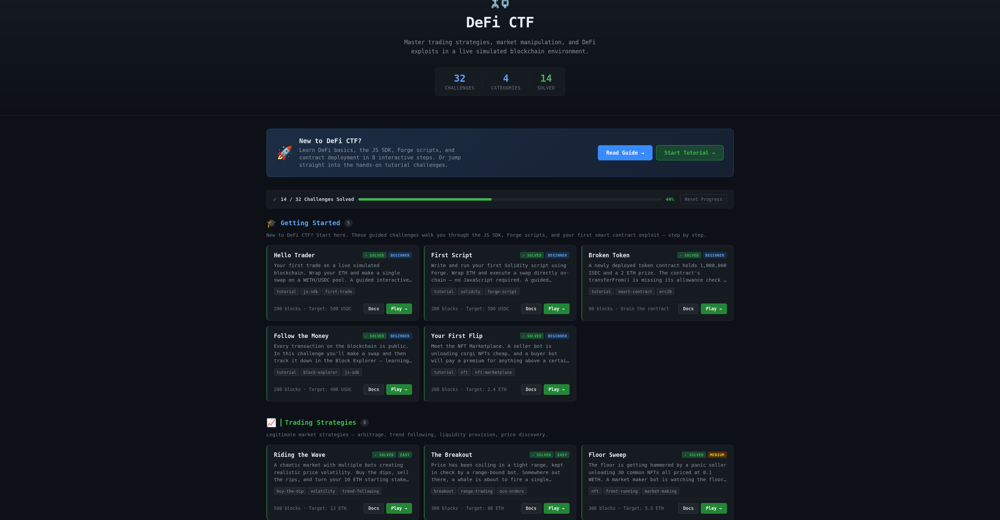
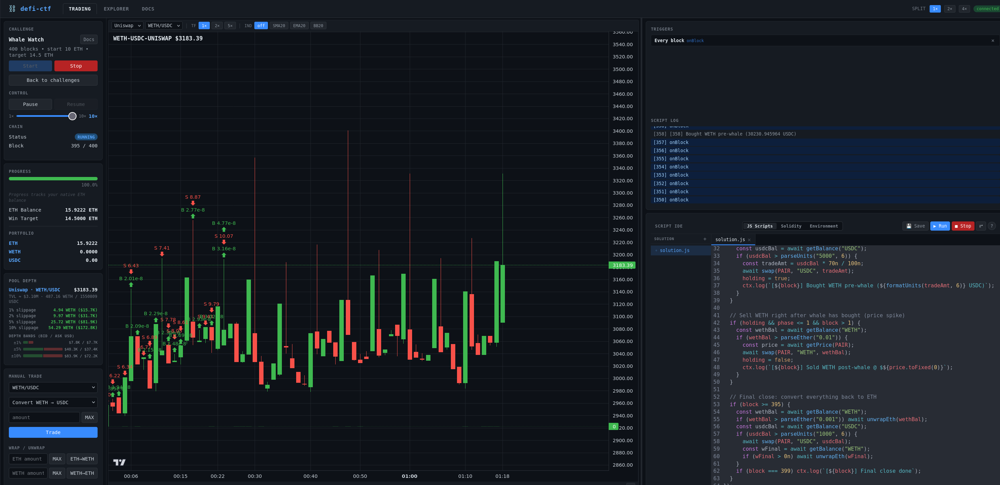

# DeFi CTF

A browser-based DeFi capture-the-flag platform. Each challenge puts you inside a live simulated
Ethereum market with a specific goal: grow your portfolio, exploit a vulnerable contract, or
manipulate the market before the clock runs out. Write JavaScript trigger scripts or Solidity
contracts, watch your strategy play out in real time, and iterate until you win.

No prior blockchain setup required. Anvil, the engine, and the frontend all run inside one Docker
container or a single `./start.sh` call.

<p align="center">
  
  &nbsp;
  
</p>

---

## Quick Start

**Option A: Docker** (recommended, no local dependencies needed)

```bash
git clone https://github.com/branover/defi-ctf.git
cd defi-ctf
docker compose -f docker/docker-compose.yml up --build
```

Open **http://localhost:5173** in your browser.

> First build takes 3-5 minutes (downloads Foundry + npm packages). Subsequent starts are fast
> since Docker caches the dependency layers.

**Option B: Local**

```bash
./setup.sh   # installs dependencies (Debian/Ubuntu/Kali)
./start.sh   # starts Anvil, the engine, and the frontend
```

Open **http://localhost:5173**.

---

## What Is This?

Each challenge runs a deterministic simulated market on a local Anvil chain. Bots trade every
block with fixed strategies. Your job is to beat them, or find the bug they left in the
contracts.

Pick a challenge on the landing page, click **Play**, and the platform:

1. Resets the chain to a clean state
2. Deploys tokens, pools, and any challenge-specific contracts
3. Mints starting balances for you and the bots
4. Starts mining blocks

Win by meeting the challenge goal before the block count hits zero. Restart instantly and try a
different approach. The market is fully deterministic, so the same setup produces the same bot
behavior every time.

> **New to DeFi?** Click **Tutorial** on the landing page for an interactive walkthrough before
> diving into challenges.

---

## Challenge Categories

### Trading Strategy
Legitimate market strategies. Spot price inefficiencies, ride trends, provide liquidity, or
execute TWAP orders within the rules of the market. Good starting point if you're new to DeFi.

### Market Manipulation
Tactics that exploit bot behavior, thin liquidity, or predictable order flow. Front-run a
clockwork whale, trigger a liquidation cascade, or pump a token and dump into the momentum
buyers. No contract bugs involved, just information asymmetry.

### DeFi Exploit
Smart contract security challenges. Find and exploit a real vulnerability: reentrancy, flash
loan attacks, uninitialized proxy ownership, arithmetic overflow, oracle manipulation, and more.
Based on real historical hacks scaled down to a single challenge.

---

## How to Interact

### 1. Web UI
Buy, sell, wrap/unwrap ETH, and manage liquidity directly from the browser. Trade markers appear
on the chart so you can see exactly where your transactions landed.

### 2. JavaScript Trigger Scripts (IDE, JS mode)
Write a script in the in-browser IDE. The script runs once to register triggers: callbacks that
fire on every block, when price crosses a threshold, etc. The full SDK (swap, getPrice,
getBalance, addLiquidity, contract calls) is available inside each trigger.

> **ETH vs WETH:** Trading pools only accept ERC-20 tokens, not native ETH. Your starting balance
> is native ETH — call `wrapEth(amount)` to convert it to WETH before trading in pools.
> Call `unwrapEth(amount)` to convert back. The win condition checks your total ETH balance,
> which includes any unwrapped WETH.

```js
// Buy the dip, sell the recovery
const id = onPriceBelow("weth-usdc-uniswap", 2800, async (ctx) => {
  const usdc = await getBalance("USDC");
  await swap("weth-usdc-uniswap", "USDC", usdc * 80n / 100n);
  removeTrigger(id);
});

onPriceAbove("weth-usdc-uniswap", 3100, async (ctx) => {
  const weth = await getBalance("WETH");
  if (weth > 0n) await swap("weth-usdc-uniswap", "WETH", weth);
});
```

See [`docs/script-sdk.md`](docs/script-sdk.md) for the full SDK reference.

### 3. Solidity IDE (IDE, Solidity mode)
Switch the IDE panel to **Solidity** mode to edit files in the per-challenge `solve/` workspace.
Click **Run Script** to execute a `forge script` against the live chain, or **Deploy** to compile
and deploy a contract. Output streams in real time.

This is the main interface for smart contract exploit challenges.

### 4. Foundry CLI
Use `forge` and `cast` from a terminal against the same Anvil instance:

```bash
cd solve/
./env.sh && source .env   # writes .env with all addresses for the running challenge
cast call $ADDR_VAULT "owner()" --rpc-url $RPC_URL
forge script script/Solve.s.sol --rpc-url $RPC_URL --private-key $PRIVATE_KEY --broadcast
```

See [`docs/foundry-workflow.md`](docs/foundry-workflow.md) for a full walkthrough.

---

## Architecture

```
Anvil (port 8545)        <- EVM execution
   ^
Engine (port 3000)       <- HTTP REST + WebSocket (challenge control, bots, triggers)
   ^
Frontend (port 5173)     <- browser UI (charts, IDE, depth panel, trade log)
```

The engine mines blocks on a timer. Each block:
1. Records prices and OHLCV candles for all pools
2. Runs every bot's `tick()` (deterministic, seeded)
3. Fires registered player triggers
4. Checks the win condition

---

## Documentation

**Start here as a player:**

| Document | What it covers |
|---|---|
| [`docs/examples.md`](docs/examples.md) | Worked JS strategy examples — best starting point after the tutorial |
| [`docs/script-sdk.md`](docs/script-sdk.md) | Full JS SDK reference (all functions, parameters, return types) |
| [`docs/foundry-workflow.md`](docs/foundry-workflow.md) | Solidity workflow (forge script, deploy, env.sh) |
| [`docs/challenges.md`](docs/challenges.md) | Challenge authoring — manifest schema, win conditions, contract types |

**Reference and advanced:**

| Document | What it covers |
|---|---|
| [`docs/bots.md`](docs/bots.md) | Bot personalities and config |
| [`docs/http-api.md`](docs/http-api.md) | HTTP REST API reference |
| [`docs/websocket-api.md`](docs/websocket-api.md) | WebSocket message protocol |
| [`docs/smart-contracts.md`](docs/smart-contracts.md) | Contract ABIs and custom deployment |

**For challenge authors:**

| Document | What it covers |
|---|---|
| [`docs/challenges.md`](docs/challenges.md) | Authoring challenges (manifest schema) |

---

## Development

```bash
./setup.sh              # first-time setup
./start.sh              # start platform
./stop.sh               # stop platform
./test/run-tests.sh     # run all tests (API + WS regression)
./test/run-tests.sh --ui  # also run Playwright UI tests

cd engine && npx tsc --noEmit    # TypeScript type-check
cd frontend && npm run build     # frontend build check
cd frontend && npm test          # frontend unit tests (Vitest)
```

### Adding a challenge

1. Create `challenges/<id>/manifest.json` (see [`docs/challenges.md`](docs/challenges.md))
2. Add a `challenges/<id>/README.md` with description and hints
3. If new contracts are needed, add `.sol` files to `contracts/src/` and run `forge build`
4. Restart the engine (challenges auto-load from the directory)

### Docker

```bash
# Start (foreground)
docker compose -f docker/docker-compose.yml up --build

# Start (detached)
docker compose -f docker/docker-compose.yml up -d --build

# Stop
docker compose -f docker/docker-compose.yml down

# Run tests inside Docker
docker compose -f docker/docker-compose.yml --profile test run --rm tests
```

Manifests in `challenges/` are mounted as a volume, so you can edit them and restart the
container without rebuilding the image.

### Git workflow

Large changes go on feature branches with atomic commits, followed by a PR before merge.
See [CLAUDE.md](CLAUDE.md) for the full workflow.
